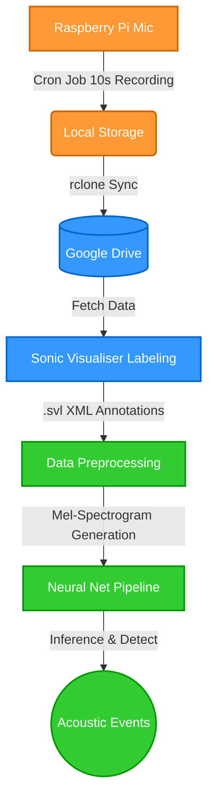

  <h1>🎙️ Bioacoustic Monitoring Framework</h1>
  
<i>A High-End Interactive Documentation Hub for End-to-End Bioacoustic Analysis</i>

  <!-- Badges -->
  

    
    
    
    
  

---

## 📌 Table of Contents

- [System Architecture](#-system-architecture)
- [Framework Structure (Clickable)](#-framework-structure)
- [Data Acquisition](#-data-acquisition)
- [Expert Labeling (The Showcase)](#-expert-labeling-the-showcase)
- [Preprocessing & Training](#-preprocessing--training)
- [External Repositories](#-external-repositories)

---

## 🏗 System Architecture

---

## 🗂 Framework Structure

  
<b>🛠 Technical Hardware Specs (Raspberry Pi Setup)</b>

   
  <ul>
    <li><b>Board:</b> Raspberry Pi (Model 3B+ or 4 recommended)</li>
    <li><b>Microphone:</b> High-fidelity USB or I2S generic bioacoustic mic</li>
    <li><b>OS:</b> Raspberry Pi OS Lite (Debian-based, Headless)</li>
    <li><b>Dependencies:</b> <code>arecord</code>, <code>sox</code>, <code>rclone</code>, <code>cron</code></li>
    <li><b>Power:</b> 5V / 3A reliable power supply (battery pack + solar panel for remote edge deployment)</li>
  </ul>

  
<b>🏷 Labeling Methodology (Sonic Visualiser Steps)</b>

   
  <ul>
    <li>Create a clean workspace with clear Spectrogram views.</li>
    <li>Use standard Window size (e.g., 1024 / 2048) and overlap (e.g., 50%) for clear temporal and frequency resolution.</li>
    <li>Maintain a consistent naming convention between <code>.wav</code> and <code>.svl</code> files.</li>
    <li>Label both positive calls and distinct hard-negative background noises when necessary.</li>
  </ul>

  
<b>🤖 Neural Network Architecture (Pipeline Details)</b>

   
  <ul>
    <li><b>Input:</b> 2D Mel-Spectrogram arrays (Time x Frequency bins).</li>
    <li><b>Architecture:</b> Convolutional Neural Network (CNN) or CRNN designed for audio tagging and temporal localization.</li>
    <li><b>Loss Function:</b> Binary Cross-Entropy (for binary presence/absence) or specialized object detection loss.</li>
    <li><b>Optimization:</b> Adam optimizer with learning rate decay.</li>
    <li><b>Evaluation Metrics:</b> Precision, Recall, F1-Score, and Intersection over Union (IoU) for time-frequency bounding boxes.</li>
  </ul>

---

## 📡 Data Acquisition

The data acquisition process is fully automated on the edge device to ensure continuous monitoring and seamless cloud backup.

* **Edge Recording:** A customized cron-job triggers robust **10-second bursts** of audio recording. This specific duration prevents file corruption and maintains highly manageable file sizes for both edge storage and downstream labeling.
* **Cloud Sync:** Uses `rclone` to automatically sync the recorded audio bursts to a dedicated Google Drive directory (`rclone copy /local GoogleDrive:/Bioacoustics`). This ensures data is safely backed up and distributed to analysts worldwide.

---

## 🎧 Expert Labeling (The Showcase)

A structured approach to annotating the bioacoustic data is crucial for training a high-performance computer vision / AI model. Here are the steps to execute precision labeling using **Sonic Visualiser**:

1. **Import Audio:** Open the 10-second `.wav` files downloaded from Google Drive into Sonic Visualiser.
2. **Add Spectrogram:** Go to `Pane > Add Spectrogram` or press `Shift + G`. Customize the settings (color scale, window size) to emphasize the target frequency ranges.
   > *[Screenshot Placeholder: Spectrogram Settings]*
3. **Add Region Layer:** Go to `Layer > Add New Time-Value Layer` to draw bounding boxes around the calls.
4. **Annotate:** Draw boxes mapping the exact frequency boundaries and time durations of the target acoustic events.
   > *[Screenshot Placeholder: Frequency-Time Boxes]*
5. **Export Annotations:** Export the annotation layer as an `.svl` (Sonic Visualiser XML) file matching the audio file's name exactly.

---

## 🧠 Preprocessing & Training

The AI pipeline is designed to directly ingest expert XML annotations alongside the raw audio waveforms.

* **XML Parsing:** The pipeline directly reads the`.svl` XML files exported from Sonic Visualiser. It extracts the precise start time, end time, lower frequency, and upper frequency of each labeled event.
* **Feature Extraction:** Using the audio files and the extracted boundary data, the preprocessing module generates high-resolution **Mel-Spectrograms** corresponding exactly to the regions of interest (as well as background noise for negative samples).
* **Model Training:** These Mel-Spectrograms serve as the direct input features for the Neural Network Architecture, enabling robust classification and event temporal detection.

---

## 🔗 External Repositories

For source code, setup instructions, and deployment scripts, please refer to the specific repositories:

* 📥 **Acquisition Repo:** [bioacoustic-edge-sync](https://github.com/milanto-hery/bioacoustic-edge-sync.git)
* ⚙️ **Pipeline Repo:** [bioacoustic-detection-pipeline](https://github.com/milanto-hery/bioacoustic-detection-pipeline.git)

---

  
Created by <a href="https://milanto-hery.github.io" target="_blank">Milanto Hery</a> | © 2026

