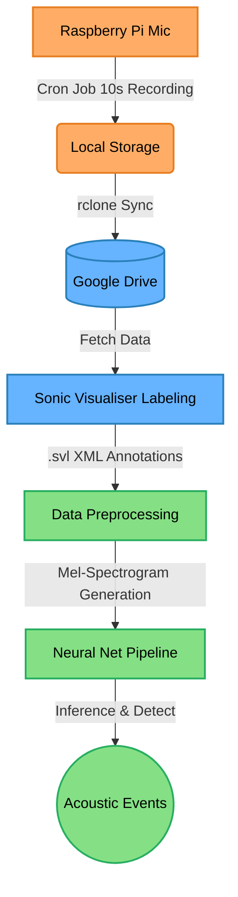

<a href="{{ site.baseurl }}/">← Back to Dashboard</a>

---

# 🏗️ System Architecture

The overarching system architecture dictates the flow of raw acoustic signals from edge hardware, through resilient remote storage, and ultimately into the advanced Neural Network framework.

### Flow Breakdown

1. **Hardware Tier (Orange):** Represents the robust, remote data collection. The Raspberry Pi system is programmed to constantly ingest acoustics without human intervention.
2. **Data Tier (Blue):** Involves the secure transmission and structured labeling of that data. Google Drive acts as the remote bridge between the physical jungle and the data scientists' desks. Sonic Visualiser enables expert manual verification.
3. **AI Tier (Green):** The automated engine. Preprocessing pipelines convert human-readable `.svl` annotations into machine-readable Mel-Spectrogram features, feeding them directly into Convolutional Neural Networks for acoustic event detection.

---

 
<a href="{{ site.baseurl }}/docs/acquisition/">➡️ Next: Data Acquisition</a>

---

  
Created by <a href="https://milanto-hery.github.io" target="_blank">Milanto Hery</a> | © 2026

  
<small>📥 <a href="https://github.com/milanto-hery/bioacoustic-edge-sync.git">Acquisition Repo</a> | ⚙️ <a href="https://github.com/milanto-hery/bioacoustic-detection-pipeline.git">Pipeline Repo</a></small>

